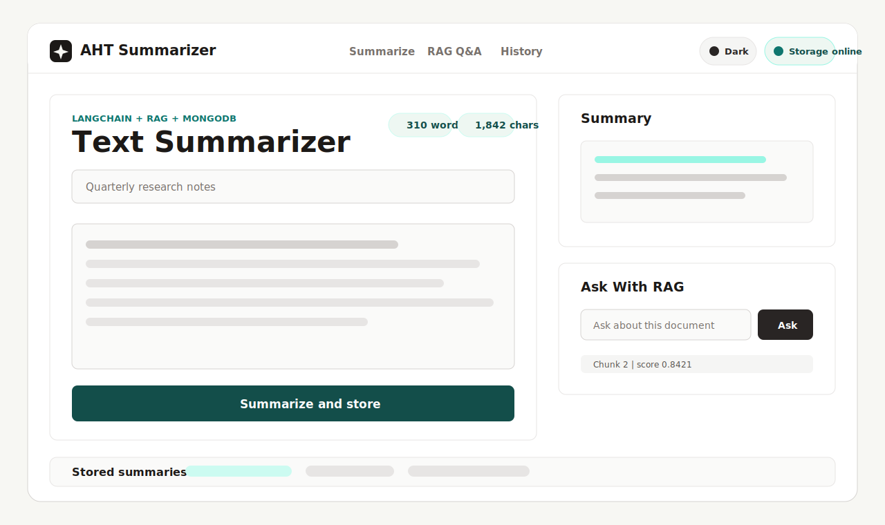
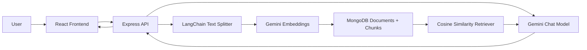

# AHT Text Summarizer



AHT Text Summarizer is a full-stack AI application that summarizes long text, stores the source material in MongoDB, and lets users ask follow-up questions with a RAG workflow. The project uses React for the frontend, Node.js and Express for the backend, LangChain for AI orchestration, Gemini for generation and embeddings, and MongoDB for persistent document storage.

## What We Built

- A clean React/Vite frontend for pasting text, selecting summary style, viewing generated summaries, asking RAG questions, and browsing stored summaries.
- A Node.js/Express backend with REST API routes for summarization, follow-up Q&A, document history, and health checks.
- Gemini model integration through LangChain for both summary generation and vector embeddings.
- RAG support by splitting text into chunks, embedding each chunk, storing embeddings in MongoDB, and retrieving the most relevant chunks for follow-up questions.
- MongoDB persistence for original text, generated summaries, chunk metadata, embeddings, and created dates.
- A meaningful navbar with working section links, light/dark theme toggle, and live API/storage status.
- A cleaner professional folder structure with frontend and backend dependencies separated.

## Preview

The image above shows the main workflow:

1. Paste source text into the summarizer panel.
2. Choose a summary style: detailed, brief, or bullets.
3. Generate and store the summary.
4. Ask follow-up questions using RAG.
5. Reopen previous summaries from stored history.

## Tech Stack

| Layer | Technology |
| --- | --- |
| Frontend | React, Vite, Tailwind CSS, Lucide Icons, Framer Motion |
| Backend | Node.js, Express |
| AI Orchestration | LangChain |
| LLM | Gemini via `@langchain/google-genai` |
| Embeddings | Gemini embedding model |
| Database | MongoDB |
| Validation | Zod |

## Architecture



## How The App Works

When a user submits text, the backend validates the request and splits the text into smaller overlapping chunks. Each chunk is embedded with Gemini embeddings and saved in MongoDB with the source document. The backend then sends the selected context and source text to Gemini through LangChain to generate a grounded summary.

For RAG Q&A, the user asks a question about a stored document. The server embeds the question, compares it with saved chunk embeddings using cosine similarity, retrieves the most relevant chunks, and sends only that context to Gemini for an answer.

## Folder Structure

```text
AHT/
  client/
    public/
      project-preview.svg
    src/
      components/
      App.jsx
      App.css
    package.json
  server/
    src/
      db.js
      index.js
      listModels.js
      summarizer.js
      vector.js
    .env
    .env.example
    package.json
  README.md
  .gitignore
```

## Environment Variables

Create your backend environment file:

```bash
copy server\.env.example server\.env
```

Fill in these values:

```env
GEMINI_API_KEY=your_gemini_api_key
GEMINI_MODEL=gemini-3.5-flash
GEMINI_EMBEDDING_MODEL=gemini-embedding-001
MONGODB_URI=mongodb://127.0.0.1:27017
MONGODB_DB=aht_summarizer
CLIENT_ORIGIN=http://localhost:5173
PORT=5000
```

Do not commit `server/.env`. It contains private API keys and database credentials.

## Installation

Install backend dependencies:

```bash
npm install --prefix server
```

Install frontend dependencies:

```bash
npm install --prefix client
```

## Run Locally

Start the backend API:

```bash
npm run dev --prefix server
```

Start the React app in another terminal:

```bash
npm run dev --prefix client
```

Open the app:

```text
http://localhost:5173
```

The frontend proxies API requests to:

```text
http://localhost:5000
```

## API Routes

| Method | Route | Purpose |
| --- | --- | --- |
| `GET` | `/api/health` | Checks whether the API is reachable |
| `GET` | `/api/documents` | Returns recent stored summaries |
| `POST` | `/api/summarize` | Summarizes text, chunks it, embeds it, and stores it |
| `POST` | `/api/ask` | Answers a question using retrieved chunks from MongoDB |

## Useful Commands

Run frontend lint:

```bash
npm run lint --prefix client
```

Build frontend:

```bash
npm run build --prefix client
```

List Gemini models available for your API key:

```bash
npm run models --prefix server
```

## Key Features

- AI text summarization with selectable summary style.
- RAG-based follow-up question answering.
- MongoDB document and vector storage.
- Stored summary history.
- Live API/storage status in the navbar.
- Light and dark theme support.
- Clean frontend/backend separation.
- Gemini model helper for debugging model-name issues.

## Notes

- `server/.env` is ignored by git and should stay private.
- MongoDB must be reachable before starting the backend.
- The default chat model is `gemini-3.5-flash`.
- The default embedding model is `gemini-embedding-001`.
